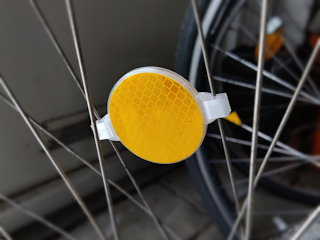
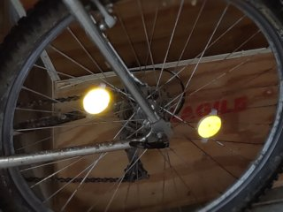
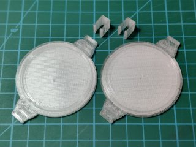

# Bicycle Spoke Reflector
*3D printable easy to mount and remove reflector base for bicycles*

### License
[Creative Commons - Attribution](https://creativecommons.org/licenses/by/4.0/)

### Gallery

[🔎](images/photo1.jpg) [🔎](images/photo2.jpg) [🔎](images/photo3.jpg)

## Description and Instructions

This is a 3D printable base for creating spoke-mounted bicycle wheel reflectors. The reflectors can be quickly mounted and removed, making them useful to temporarily make a recreational bike road-legal. Some kind of retroreflective tape is required to make these actually work as reflectors. High-quality tape like the 3M tape I have used, will outperform the classic orange “cat eye” plastic reflectors. Don't use simple mirror tape, it must be something that sends light back to where it came from.

These come in 2 variants: the `18` files are meant for 1.8 mm spokes, the `20` files are for 2.0 mm spokes and also have some extra sideways clearance. In case of doubt, print one of both variants and see what works best.

The Blender source file is included, and contains the `18` model. The `20` model was derived by manipulating the generated meshes to increase clearances.

### Printing

One set of an A + B part + 2 ‘locks’ will yield one reflector. You may want to print some spare clips in case you lose or break them.

I recommend PETG or another durable material. ASA would also be a good choice. PLA is not recommended, because it tends to become brittle over time (especially when exposed to the elements), and the mounting clips will likely lose their springiness due to PLA's tendency to ‘creep’ under tension.

I have printed these at 0.2 mm layer height. Infill should be 100%.

### Mounting

Stick a 50 mm disk of retroreflective tape to the flat side of both an A and B part, and push the parts together around a pair of spokes. Add 2 lock clips by sliding them on from the sides. To remove, slide off the locking clips.
If the reflector doesn't grip the spokes well enough and moves around, you could add a tiny bit of duct tape as padding.

## Disclaimer

This design comes with no warranties or liabilities. Whether the reflectors will be road-legal, will depend on what reflective tape you use.

## Tags
`bicycle`, `bike`, `spoke`, `wheel`, `reflector`, `safety`
